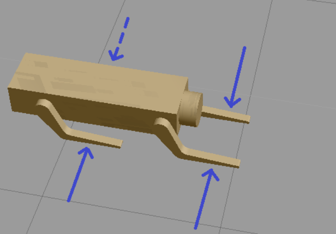
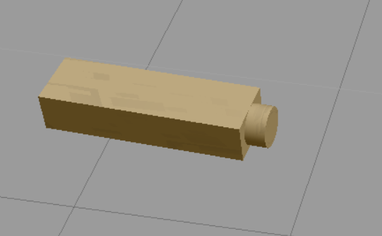

### Robotics Software Engineer - Nanodegree

# Project 04 (of 05) : Map My World
## Directory Structure
```
.Map_My_World                                        # Map_My_World project
   ├── my_robot                                      # my_robot package
   │   ├── CMakeLists.txt                            # compiler instructions
   │   ├── launch                                    # launch folder for launch files
   │   │   ├── amcl.launch
   │   │   ├── config_rviz.rviz                      # configuration file for RViz for quick setup
   │   │   ├── localization.launch
   │   │   ├── mapping.launch                        # launches the RTAB-Map mapping node
   │   │   ├── robot_description.launch
   │   │   ├── teleop.launch                         # launches teleop package to control robot using keyboard
   │   │   └── world.launch                          # launches gazebo environment and RViz
   │   ├── maps
   │   │   ├── my_map.pgm                            # 2D map
   │   │   ├── my_map.yaml                           # metadata about the map
   │   │   └── rtabmap.db                            # Data file of mapping
   │   ├── meshes                                    # meshes folder for sensor and custom model
   │   │   ├── hokuyo.dae                            # mesh for laser scanner
   │   │   └── RoboLeg.STL                           # CAD file of Robot's leg (made in SolidWorks)
   │   ├── package.xml                               # package info
   │   ├── urdf                                      # urdf folder for xarco files
   │   │   ├── my_robot.gazebo
   │   │   └── my_robot.xacro
   │   └── worlds                                    # world folder for world files
   │       └── Avadhoot.world
   ├── teleop_twist_keyboard                         # ROS package
   │   ├── CHANGELOG.rst
   │   ├── CMakeLists.txt                            # compiler instructions
   │   ├── package.xml                               # package info
   │   ├── README.md
   │   └── teleop_twist_keyboard.py                  # python script for controlling robot
   ├── LICENSE
   ├── README.md
```  

## Project Goals
Developing package to interface with the ```rtabmap_ros``` package.

Adding a RGB-D camera on the custom robot.

Generating the appropriate launch files to launch the robot and map its surrounding environment.

When your robot is launched teleop around the room to collect the sensor data for generating the map.

Use the ```rtabmap-databaseViewer``` to extract the map from the data collected.

## Output
Point cloud map (3D map)


2D occupancy grid map (2D map)


World as seen in gazebo


The ```rtabmap.db```, ```my_map.pgm```, ```map.yaml``` files are included in their original position as created in my system.

If you want to view the database (it will be deleted if you start creating your own, at step: [(5. Launch the mapping node)](#5-Launch-the-mapping-node)), skip to [step 8](#8-Explore-the-generated-map-using-rtabmap-databaseViewer)


## Environment
Tested on Ubuntu 16.04.6 LTS, ROS Kinetic, Boost 1.58

## Setup and run
Note: The commands in this README work, considering that the main workspace is located at ```/home/robond/workspace/catkin_ws/src```      
      Notice the ```robond``` username. Make appropriate changes for your system.

**Important: Make adjustments to the address of ```mapping.launch ``` file at line 5.**

The file is located here:``` ~/Map_My_World/my_robot/launch```


Warning: Some minor features will not work in your system if your username of the system is different.

[Click here for the fix and to learn more](#Missing-minor-feature)
#### 1. Update the Workspace image
```
$ sudo apt-get update && sudo apt-get upgrade -y 
```

#### 2. Clone the files in /home/workspace
Cloning this repository:
```
$ cd /home/robond/workspace/catkin_ws/src
$ git clone https://github.com/Avadhoot94/Map_My_World.git
```

Cloning ```ROS teleop``` package:
```
$ cd /home/robond/workspace/catkin_ws/src/Map_My_World
$ git clone https://github.com/ros-teleop/teleop_twist_keyboard
```
#### 3. Build the packages
```
$ cd /home/robond/workspace/catkin_ws
$ catkin_make
$ source devel/setup.bash
````
#### 4. Launch the world and the robot
```
$ roslaunch my_robot world.launch
```
Make sure the ```fixed frame``` in ```RViz``` is ```odom```

#### 5. Launch the mapping node
**Remember, launching the mapping node deletes any previously mapped database in place, on launch start up!** 
```
$ roslaunch my_robot mapping.launch
```
#### 6. Launch the teleop node
```
$ roslaunch my_robot teleop.launch
```
#### 7. Collect environment data
Drive around in the world using the keyboard controls from ```teleop``` node.

The RGB-D camera on the robot will collect the data for generating the map.

For best results, go over similar paths two or three times and drive at slow speed (especially rotational).
These speeds can be controlled in the ```teleop``` node.

Do not stop any running node yet.

#### 9. Save 2D occupancy map
```
$ rosrun map_server map_saver -f /home/robond/workspace/catkin_ws/src/Map_My_World/my_robot/maps/my_map
```

Once data collection is done and map is saved, stop the mapping node by pressing ```Ctrl```+``` C```
The data will be stored as ```rtabmap.db``` in the following file location:

```/home/robond/workspace/catkin_ws/src/Map_My_World/my_robot/maps```

**Remember, launching the mapping node deletes any previously mapped database in place, on launch start up!** 

#### 8. Explore the generated map using ```rtabmap-databaseViewer```
```
$ rtabmap-databaseViewer /home/robond/workspace/catkin_ws/src/Map_My_World/my_robot/maps/rtabmap.db
```


## Missing minor feature
The ```~/Map_My_World/my_robot/world/Avadhoot.world``` file uses ```~/Map_My_World/my_robot/meshes/RoboLeg.STL``` for the legs of the **static** robot model as indicated in the picture below:



<p>&nbsp;</p>

The ```Avadhoot.world``` file thus, contains the directory address of the ```RoboLeg.STL``` as ```/home/robond/workspace/catkin_ws/src/Map_My_World/my_robot/meshes/RoboLeg.STL```<br/> **Replace all** the addresses appropriately to see the legs. 

Else the package will **run without errors** but without the legs as seen below:


